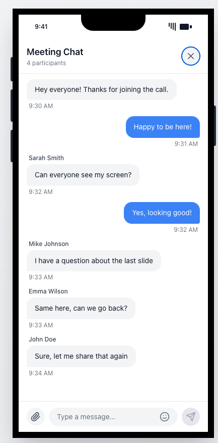
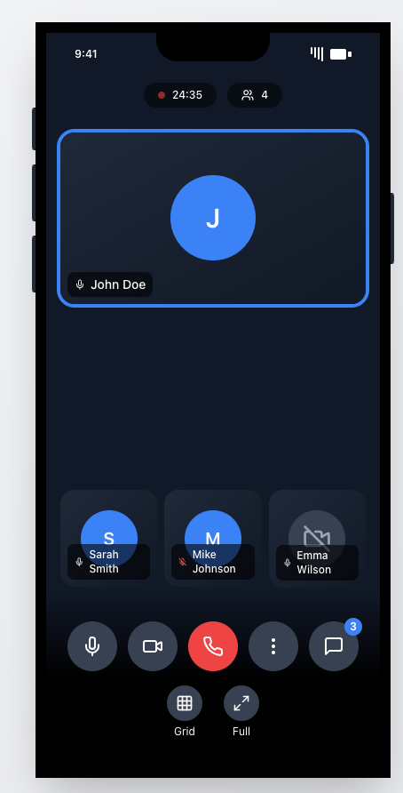
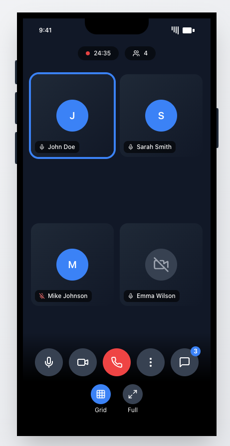
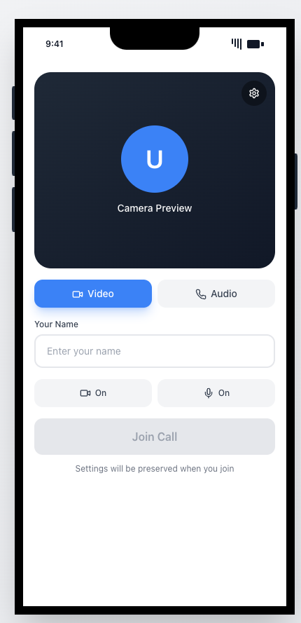

# Daily SDK Flutter Demo

A Flutter project demonstrating Daily.co video call SDK integration with Riverpod state management.

## Prerequisites

- Flutter SDK
- FVM (Flutter Version Management)
- Xcode (for iOS development)
- Android Studio (for Android development)

## Setup

1. Install FVM (if not already installed):
   ```bash
   brew tap leoafarias/fvm
   brew install fvm
   ```

2. Install project dependencies:
   ```bash
   make setup
   make deps
   ```

## Available Commands

Use these commands to manage the project:

### Setup & Dependencies
- `make add` - Add a new package
- `make get` - Get all dependencies
- `make clean` - Clean the project


## Getting Started with Flutter

A few resources to get you started if this is your first Flutter project:

- [Lab: Write your first Flutter app](https://docs.flutter.dev/get-started/codelab)
- [Cookbook: Useful Flutter samples](https://docs.flutter.dev/cookbook)

For help getting started with Flutter development, view the
[online documentation](https://docs.flutter.dev/), which offers tutorials,
samples, guidance on mobile development, and a full API reference.

## Screenshots

<p float="left">
  
  
  
  
  
</p>
